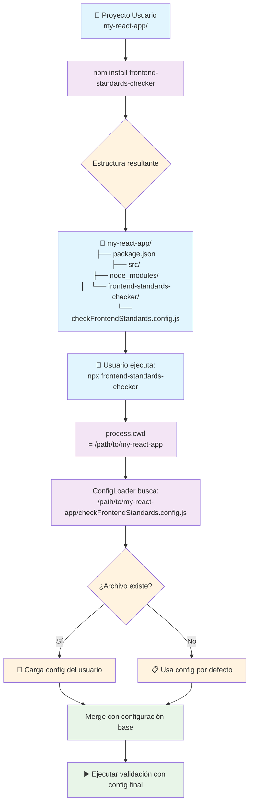

# 📋 Sistema de Configuración - Frontend Standards Checker

## 🎯 **Cómo Funciona la Configuración**

El Frontend Standards Checker utiliza un sistema de configuración flexible que permite a cada proyecto personalizar las reglas de validación según sus necesidades específicas.

## 🔄 **Flujo del Sistema de Configuración**



## 📂 **Ubicación de Archivos**

### **Separación Clara de Responsabilidades**

```
📂 Proyecto del Usuario (my-react-app/)
├── package.json
├── node_modules/
│   └── frontend-standards-checker/     ← Paquete instalado
│       ├── launcher.cjs
│       ├── src/
│       ├── bin/
│       └── checkFrontendStandards.config.example.js
├── checkFrontendStandards.config.js    ← Configuración del USUARIO
└── src/
```

**Puntos clave:**
- ✅ **El archivo de configuración está en el proyecto del usuario**
- ✅ **No se incluye automáticamente en la instalación**
- ✅ **El usuario debe crearlo según sus necesidades**
- ✅ **Fallback automático a configuración por defecto**

## 🔍 **Proceso de Búsqueda de Configuración**

### **Prioridad de Carga**

1. **📁 Archivo personalizado**: `--config ./mi-config.js`
2. **📄 Archivo por defecto**: `./checkFrontendStandards.config.js`
3. **⚙️ Configuración built-in**: Reglas predeterminadas

### **Implementación del ConfigLoader**

```typescript
async load(customConfigPath: string | null = null): Promise<IProjectConfig> {
  const configPath = customConfigPath || 
    path.join(this.rootDir, this.configFileName);

  try {
    if (fs.existsSync(configPath)) {
      this.logger.info(`📋 Loading configuration from: ${configPath}`);
      
      // Import dinámico con cache busting
      const configModule = await import(`${configPath}?t=${Date.now()}`);
      const customConfig = configModule.default || configModule;
      
      return this.mergeWithDefaults(customConfig);
    }
  } catch (error) {
    this.logger.warn(`Failed to load config from ${configPath}:`, error);
  }
  
  this.logger.info("📋 Using default configuration");
  return this.getDefaultConfig();
}
```

## 📋 **Formatos de Configuración Soportados**

### **1. Configuración Objeto (Recomendado)**
```javascript
// checkFrontendStandards.config.js
export default {
  projectType: 'react',
  
  structure: {
    enforceStructure: true,
    allowedDirectories: ['src', 'public', 'assets']
  },
  
  naming: {
    files: 'kebab-case',
    directories: 'kebab-case',
    components: 'PascalCase'
  },
  
  zones: {
    'src/components': {
      allowedExtensions: ['.tsx', '.ts'],
      naming: 'PascalCase',
      requiredFiles: ['index.ts']
    }
  },
  
  customRules: [
    {
      name: 'No console statements',
      pattern: /console\./,
      message: 'Remove console statements from production code',
      severity: 'error'
    }
  ]
};
```

### **2. Configuración como Función**
```javascript
// checkFrontendStandards.config.js
export default function(defaultConfig) {
  return {
    ...defaultConfig,
    
    // Agregar reglas a las existentes
    customRules: [
      ...defaultConfig.customRules,
      {
        name: 'Custom validation',
        check: (content, filePath) => {
          // Lógica personalizada
          return content.includes('forbidden-pattern');
        },
        message: 'Custom rule violation'
      }
    ],
    
    // Modificar zonas
    zones: {
      ...defaultConfig.zones,
      'src/custom': {
        allowedExtensions: ['.custom.ts'],
        naming: 'camelCase'
      }
    }
  };
}
```

### **3. Configuración como Array**
```javascript
// checkFrontendStandards.config.js
export default [
  {
    name: 'Project specific rule',
    check: (content) => content.includes('bad-pattern'),
    message: 'This pattern is not allowed in our project'
  },
  {
    name: 'Another custom rule',
    pattern: /deprecated-function/,
    message: 'Use the new API instead'
  }
];
```

### **4. Configuración Condicional**
```javascript
// checkFrontendStandards.config.js
const isDevelopment = process.env.NODE_ENV === 'development';
const isProduction = process.env.NODE_ENV === 'production';

export default {
  projectType: 'react',
  
  customRules: [
    // Reglas base
    {
      name: 'No var keyword',
      pattern: /\bvar\s/,
      message: 'Use let or const instead of var'
    },
    
    // Reglas solo para producción
    ...(isProduction ? [
      {
        name: 'No console statements',
        pattern: /console\./,
        message: 'Remove console statements for production',
        severity: 'error'
      },
      {
        name: 'No TODO comments',
        pattern: /(TODO|FIXME|HACK)/i,
        message: 'Resolve TODO comments before production',
        severity: 'warning'
      }
    ] : []),
    
    // Reglas solo para desarrollo
    ...(isDevelopment ? [
      {
        name: 'Encourage documentation',
        check: (content, filePath) => {
          if (filePath.includes('src/components/') && filePath.endsWith('.tsx')) {
            return !content.includes('/**');
          }
          return false;
        },
        message: 'Consider adding JSDoc documentation to components',
        severity: 'info'
      }
    ] : [])
  ]
};
```

## ⚙️ **Configuración por Defecto**

### **Reglas Built-in**
```javascript
const defaultRules = [
  {
    name: "No console.log",
    check: (content) => content.includes("console.log"),
    message: "The use of console.log is not allowed in production code."
  },
  {
    name: "No var",
    check: (content) => /\bvar\b/.test(content),
    message: "Avoid using var, use let or const."
  },
  {
    name: "Interface naming convention",
    check: (content) => {
      const interfaceMatches = content.match(/export\s+interface\s+([A-Za-z_]\w*)/g);
      if (interfaceMatches) {
        return interfaceMatches.some(match => {
          const interfaceName = match.replace(/export\s+interface\s+/, "");
          return !/^I[A-Z][a-zA-Z0-9]*$/.test(interfaceName);
        });
      }
      return false;
    },
    message: "Exported interfaces must start with I followed by PascalCase."
  }
];
```

### **Estructura Esperada**
```javascript
const defaultStructure = {
  app: ["pages", "components", "public"],
  package: ["src", "package.json"],
  src: {
    assets: [],
    components: ["index.ts"],
    constants: ["index.ts"],
    hooks: ["index.ts"],
    utils: ["index.ts"]
  }
};
```

### **Patrones Ignorados por Defecto**
```javascript
const defaultIgnorePatterns = [
  "node_modules",
  ".next",
  ".git",
  "__tests__",
  "__test__",
  "coverage",
  "dist",
  "build"
];
```

## 🚀 **Setup para Usuarios**

### **Instalación Básica**
```bash
# 1. Instalar el paquete
npm install --save-dev frontend-standards-checker

# 2. Usar configuración por defecto (sin archivo de config)
npx frontend-standards-checker

# 3. Crear configuración personalizada (opcional)
touch checkFrontendStandards.config.js
```

### **Configuración Inicial Recomendada**
```javascript
// checkFrontendStandards.config.js
export default {
  // Tipo de proyecto (determina reglas específicas)
  projectType: 'react', // 'react' | 'angular' | 'vue' | 'vanilla'
  
  // Estructura de directorios
  structure: {
    enforceStructure: true,
    allowedDirectories: ['src', 'public', 'docs'],
    disallowedPatterns: ['temp/', '*.tmp']
  },
  
  // Convenciones de nomenclatura
  naming: {
    files: 'kebab-case',      // 'kebab-case' | 'camelCase' | 'PascalCase'
    directories: 'kebab-case',
    components: 'PascalCase'
  },
  
  // Reglas personalizadas para tu proyecto
  customRules: [
    {
      name: 'Company coding standards',
      pattern: /company-specific-pattern/,
      message: 'Follow company coding standards',
      severity: 'warning'
    }
  ]
};
```

## 🎯 **Casos de Uso Avanzados**

### **Monorepo con Múltiples Configs**
```javascript
// Root: checkFrontendStandards.config.js
export default {
  projectType: 'monorepo',
  
  zones: {
    'apps/web': {
      configPath: './apps/web/frontend-standards.config.js'
    },
    'apps/mobile': {
      configPath: './apps/mobile/frontend-standards.config.js'
    },
    'packages/*': {
      naming: 'camelCase',
      allowedExtensions: ['.ts']
    }
  }
};

// apps/web/frontend-standards.config.js
export default {
  extends: '../../checkFrontendStandards.config.js',
  
  customRules: [
    {
      name: 'Web-specific rule',
      pattern: /web-pattern/,
      message: 'Web app specific validation'
    }
  ]
};
```

### **Configuración por Equipos**
```javascript
// checkFrontendStandards.config.js
import { teamConfigs } from './team-standards/index.js';

const currentTeam = process.env.TEAM || 'frontend';

export default {
  ...teamConfigs[currentTeam],
  
  // Reglas globales de la empresa
  customRules: [
    ...teamConfigs[currentTeam].customRules,
    {
      name: 'Company security standard',
      pattern: /security-violation/,
      message: 'Follow company security guidelines'
    }
  ]
};
```

## 🛠️ **Debugging y Troubleshooting**

### **Verificar Carga de Configuración**
```bash
# Modo verbose para ver qué configuración se carga
npx frontend-standards-checker --verbose

# Especificar archivo de configuración personalizado
npx frontend-standards-checker --config ./custom-config.js

# Ver el proceso de carga paso a paso
DEBUG=config npx frontend-standards-checker
```

### **Mensajes de Log del ConfigLoader**
```
📋 Loading configuration from: /path/to/project/checkFrontendStandards.config.js
✅ Configuration loaded successfully
🔀 Merging with default configuration
📊 Final configuration: 15 rules, 3 zones
```

### **Errores Comunes y Soluciones**

#### **Error: Cannot load configuration**
```bash
# Problema: Sintaxis incorrecta en el archivo de config
# Solución: Verificar sintaxis ES modules
export default { /* config */ }; // ✅ Correcto
module.exports = { /* config */ }; // ❌ Incorrecto (CommonJS)
```

#### **Error: Configuration file not found**
```bash
# El archivo debe estar en la raíz del proyecto
./checkFrontendStandards.config.js  # ✅ Correcto
./config/checkFrontendStandards.config.js  # ❌ No se encuentra automáticamente

# Use --config para ubicaciones personalizadas
npx frontend-standards-checker --config ./config/my-standards.js
```

## 📚 **Referencia de API de Configuración**

### **Estructura Completa de Configuración**
```typescript
interface IProjectConfig {
  projectType?: 'react' | 'angular' | 'vue' | 'vanilla' | 'monorepo';
  
  structure?: {
    enforceStructure?: boolean;
    allowedDirectories?: string[];
    disallowedPatterns?: string[];
  };
  
  naming?: {
    files?: 'kebab-case' | 'camelCase' | 'PascalCase';
    directories?: 'kebab-case' | 'camelCase' | 'PascalCase';
    components?: 'kebab-case' | 'camelCase' | 'PascalCase';
  };
  
  zones?: Record<string, {
    allowedExtensions?: string[];
    naming?: string;
    maxDepth?: number;
    requiredFiles?: string[];
    disallowedPatterns?: string[];
  }>;
  
  customRules?: Array<{
    name: string;
    check?: (content: string, filePath: string) => boolean;
    pattern?: RegExp;
    message: string;
    severity?: 'error' | 'warning' | 'info';
  }>;
  
  extensions?: string[];
  ignorePatterns?: string[];
}
```

## 📖 **Ejemplos por Tipo de Proyecto**

### **React + TypeScript**
```javascript
export default {
  projectType: 'react',
  
  zones: {
    'src/components': {
      allowedExtensions: ['.tsx'],
      naming: 'PascalCase',
      requiredFiles: ['index.ts']
    },
    'src/hooks': {
      allowedExtensions: ['.ts'],
      naming: 'camelCase',
      prefix: 'use'
    },
    'src/utils': {
      allowedExtensions: ['.ts'],
      naming: 'camelCase'
    }
  },
  
  customRules: [
    {
      name: 'React component export',
      check: (content, filePath) => {
        if (filePath.includes('/components/') && filePath.endsWith('.tsx')) {
          return !content.includes('export default');
        }
        return false;
      },
      message: 'React components must have default export'
    }
  ]
};
```

### **Vue 3 + Composition API**
```javascript
export default {
  projectType: 'vue',
  
  zones: {
    'src/components': {
      allowedExtensions: ['.vue'],
      naming: 'PascalCase'
    },
    'src/composables': {
      allowedExtensions: ['.ts'],
      naming: 'camelCase',
      prefix: 'use'
    }
  },
  
  customRules: [
    {
      name: 'Vue 3 composition API',
      pattern: /<script\s+setup>/,
      message: 'Use Composition API with <script setup>',
      severity: 'info'
    }
  ]
};
```

### **Angular + Standalone Components**
```javascript
export default {
  projectType: 'angular',
  
  zones: {
    'src/app/components': {
      allowedExtensions: ['.component.ts'],
      naming: 'kebab-case'
    },
    'src/app/services': {
      allowedExtensions: ['.service.ts'],
      naming: 'kebab-case'
    }
  },
  
  customRules: [
    {
      name: 'Angular standalone components',
      check: (content, filePath) => {
        if (filePath.endsWith('.component.ts')) {
          return !content.includes('standalone: true');
        }
        return false;
      },
      message: 'Consider using standalone components'
    }
  ]
};
```

## 🔄 **Migración y Versionado**

### **Actualizar Configuración Existente**
```javascript
// Para proyectos existentes que actualizan el paquete
export default function(defaultConfig) {
  // Mantener reglas personalizadas existentes
  const existingRules = [
    // Reglas legacy del proyecto
  ];
  
  return {
    ...defaultConfig,
    customRules: [
      ...defaultConfig.customRules,
      ...existingRules
    ]
  };
}
```

### **Configuración Compatible con Versiones**
```javascript
const packageVersion = process.env.STANDARDS_VERSION || '1.0.0';

export default {
  version: packageVersion,
  
  // Configuración que funciona con múltiples versiones
  customRules: [
    ...(packageVersion >= '1.1.0' ? [
      // Nuevas reglas solo para versiones recientes
    ] : []),
    
    // Reglas compatibles con todas las versiones
    {
      name: 'Universal rule',
      pattern: /pattern/,
      message: 'Works with all versions'
    }
  ]
};
```

## 🎉 **Conclusión**

El sistema de configuración del Frontend Standards Checker está diseñado para ser:

- **🔧 Flexible**: Múltiples formatos y opciones
- **🎯 Específico**: Configuración por proyecto y equipo
- **🔄 Evolutivo**: Fácil actualización y migración
- **🛡️ Robusto**: Fallbacks automáticos y manejo de errores
- **📚 Documentado**: Ejemplos claros y referencia completa

**El usuario mantiene control total sobre sus reglas mientras aprovecha la potencia de las validaciones predeterminadas.** 
