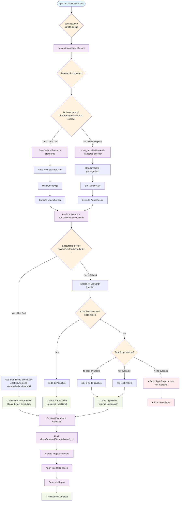

# 🔧 Configuraciones de Ejemplo por Tecnología

Esta carpeta contiene configuraciones pre-construidas para diferentes tecnologías y frameworks.

## 📁 Estructura

```
examples/
├── react-typescript.config.js
├── vue-typescript.config.js
├── angular.config.js
├── node-express.config.js
├── next-js.config.js
├── nuxt.config.js
└── monorepo.config.js
```

## 🚀 React + TypeScript

```javascript
// examples/react-typescript.config.js
export default [
  // Componentes funcionales
  {
    name: 'React functional components only',
    check: (content, filePath) => {
      if (!filePath.endsWith('.tsx')) return false;
      return /class\s+\w+\s+extends\s+(React\.)?Component/.test(content);
    },
    message: 'Use functional components instead of class components.',
  },

  // TypeScript estricto
  {
    name: 'No any types',
    check: (content) => /:\s*any\b/.test(content),
    message: 'Avoid using "any" type. Use specific types instead.',
  },

  // Props interface requerida
  {
    name: 'Component props interface',
    check: (content, filePath) => {
      if (!filePath.endsWith('.tsx')) return false;
      if (!content.includes('export') || !content.includes('function')) return false;
      return !content.includes('interface') && !content.includes('type');
    },
    message: 'React components must define prop types with interface or type.',
  },

  // Hooks en orden correcto
  {
    name: 'Hooks rules',
    check: (content, filePath) => {
      if (!filePath.endsWith('.tsx') && !filePath.includes('.hook.')) return false;
      const lines = content.split('\n');
      let foundHook = false;
      let foundOtherCode = false;

      for (const line of lines) {
        if (/use[A-Z]\w*\(/.test(line)) {
          if (foundOtherCode) return true;
          foundHook = true;
        } else if (line.trim() && !line.startsWith('import') && !line.startsWith('//')) {
          foundOtherCode = true;
        }
      }
      return false;
    },
    message: 'React hooks must be declared at the top of the component.',
  },

  // Styled components naming
  {
    name: 'Styled components naming',
    check: (content) => {
      const styledComponents = content.match(/const\s+(\w+)\s*=\s*styled/g);
      if (styledComponents) {
        return styledComponents.some(comp => {
          const name = comp.match(/const\s+(\w+)/)[1];
          return !/^[A-Z]\w*(Container|Wrapper|Box|Button|Input|Text)$/.test(name);
        });
      }
      return false;
    },
    message: 'Styled components must be PascalCase with descriptive suffix.',
  }
];
```

## 🟢 Vue.js + TypeScript

```javascript
// examples/vue-typescript.config.js
export default [
  // Composition API
  {
    name: 'Use Composition API',
    check: (content, filePath) => {
      if (!filePath.endsWith('.vue')) return false;
      return content.includes('Vue.extend') ||
             (content.includes('<script>') && !content.includes('<script setup>'));
    },
    message: 'Use Composition API with <script setup> syntax.',
  },

  // TypeScript en script
  {
    name: 'TypeScript in Vue components',
    check: (content, filePath) => {
      if (!filePath.endsWith('.vue')) return false;
      return content.includes('<script>') && !content.includes('lang="ts"');
    },
    message: 'Vue components should use TypeScript: <script lang="ts">',
  },

  // Props definidas
  {
    name: 'Vue props definition',
    check: (content, filePath) => {
      if (!filePath.endsWith('.vue')) return false;
      if (!content.includes('defineProps')) return false;
      return !content.includes('interface') && !content.includes('type');
    },
    message: 'Vue props must be typed with interface or type definition.',
  },

  // Emits definidos
  {
    name: 'Vue emits definition',
    check: (content, filePath) => {
      if (!filePath.endsWith('.vue')) return false;
      return content.includes('$emit') && !content.includes('defineEmits');
    },
    message: 'Use defineEmits() to type component events.',
  }
];
```

## 🅰️ Angular

```javascript
// examples/angular.config.js
export default [
  // OnPush strategy
  {
    name: 'Angular OnPush strategy',
    check: (content, filePath) => {
      if (!filePath.endsWith('.component.ts')) return false;
      return content.includes('@Component') &&
             !content.includes('ChangeDetectionStrategy.OnPush');
    },
    message: 'Components should use OnPush change detection strategy.',
  },

  // Interfaces para servicios
  {
    name: 'Service interfaces',
    check: (content, filePath) => {
      if (!filePath.endsWith('.service.ts')) return false;
      return content.includes('http.') && !content.includes('interface');
    },
    message: 'Services making HTTP calls should define response interfaces.',
  },

  // RxJS operators import
  {
    name: 'RxJS operators import',
    check: (content) => {
      return /import.*rxjs\/operators/.test(content);
    },
    message: 'Import RxJS operators directly: import { map } from "rxjs/operators"',
  },

  // Lifecycle hooks
  {
    name: 'Angular lifecycle hooks',
    check: (content, filePath) => {
      if (!filePath.endsWith('.component.ts')) return false;
      const hasLifecycle = /ng(OnInit|OnDestroy|AfterViewInit)/.test(content);
      const hasImplements = /implements.*ng(OnInit|OnDestroy|AfterViewInit)/.test(content);
      return hasLifecycle && !hasImplements;
    },
    message: 'Components using lifecycle hooks must implement the interface.',
  }
];
```

## 🚀 Node.js + Express

```javascript
// examples/node-express.config.js
export default [
  // Error handling middleware
  {
    name: 'Express error handling',
    check: (content, filePath) => {
      if (!filePath.includes('route') && !filePath.includes('controller')) return false;
      return content.includes('app.') && !content.includes('try') && !content.includes('catch');
    },
    message: 'API routes must have proper error handling with try/catch.',
  },

  // Environment variables validation
  {
    name: 'Environment variables fallback',
    check: (content) => {
      const envUsage = content.match(/process\.env\.(\w+)/g);
      if (envUsage) {
        return envUsage.some(env => {
          const varName = env.replace('process.env.', '');
          return !content.includes(`${env} ||`) && !content.includes(`${env} ??`);
        });
      }
      return false;
    },
    message: 'Environment variables should have fallback values.',
  },

  // Async route handlers
  {
    name: 'Async route handlers',
    check: (content, filePath) => {
      if (!filePath.includes('route')) return false;
      return /app\.(get|post|put|delete).*function/.test(content) &&
             !/async.*function/.test(content);
    },
    message: 'Route handlers should be async functions.',
  },

  // Input validation
  {
    name: 'Request validation',
    check: (content, filePath) => {
      if (!filePath.includes('route')) return false;
      return content.includes('req.body') && !content.includes('validate');
    },
    message: 'Routes accepting body data should validate input.',
  }
];
```

## ⚡ Next.js

```javascript
// examples/next-js.config.js
export default [
  // Server components por defecto
  {
    name: 'Next.js Server Components',
    check: (content, filePath) => {
      if (!filePath.includes('/app/') || !filePath.endsWith('.tsx')) return false;
      return content.includes('useState') && !content.includes('"use client"');
    },
    message: 'Components using hooks must have "use client" directive.',
  },

  // Metadata API
  {
    name: 'Next.js Metadata API',
    check: (content, filePath) => {
      if (!filePath.includes('page.tsx') && !filePath.includes('layout.tsx')) return false;
      return content.includes('<title>') || content.includes('<meta');
    },
    message: 'Use Next.js Metadata API instead of manual meta tags.',
  },

  // Image optimization
  {
    name: 'Next.js Image component',
    check: (content) => {
      return / {
      if (!filePath.endsWith('.tsx')) return false;
      const hasHeavyImports = /import.*charts|diagrams|editor/.test(content);
      return hasHeavyImports && !content.includes('dynamic(');
    },
    message: 'Use dynamic imports for heavy components.',
  }
];
```

## 🎭 Nuxt.js

```javascript
// examples/nuxt.config.js
export default [
  // Composables naming
  {
    name: 'Nuxt composables naming',
    check: (content, filePath) => {
      if (!filePath.includes('/composables/')) return false;
      const fileName = filePath.split('/').pop();
      return !fileName.startsWith('use') || !/^use[A-Z]/.test(fileName);
    },
    message: 'Composables must start with "use" followed by PascalCase.',
  },

  // Server API routes
  {
    name: 'Nuxt server API structure',
    check: (content, filePath) => {
      if (!filePath.includes('/server/api/')) return false;
      return !content.includes('export default') || !content.includes('defineEventHandler');
    },
    message: 'Server API routes must export default defineEventHandler.',
  },

  // Auto-imports usage
  {
    name: 'Nuxt auto-imports',
    check: (content) => {
      return /import.*ref.*from.*vue/.test(content) ||
             /import.*computed.*from.*vue/.test(content);
    },
    message: 'Use Nuxt auto-imports instead of manual Vue imports.',
  }
];
```

## 🏗️ Monorepo Configuration

```javascript
// examples/monorepo.config.js
export default function(defaultRules) {
  const packagePath = process.cwd();
  const packageName = require('./package.json').name;

  // Reglas base
  let rules = [...defaultRules];

  // Reglas para packages compartidos
  if (packagePath.includes('/packages/shared') || packagePath.includes('/packages/common')) {
    rules.push({
      name: 'Shared package exports',
      check: (content, filePath) => {
        if (!filePath.endsWith('index.ts')) return false;
        return !content.includes('export');
      },
      message: 'Shared packages must export their public API through index.ts',
    });

    rules.push({
      name: 'No external app dependencies',
      check: (content) => {
        return /import.*from.*['"]@apps\//.test(content);
      },
      message: 'Shared packages cannot depend on app-specific packages.',
    });
  }

  // Reglas para aplicaciones
  if (packagePath.includes('/apps/')) {
    rules.push({
      name: 'App import organization',
      check: (content) => {
        const lines = content.split('\n');
        let foundSharedImport = false;
        let foundLocalImport = false;

        for (const line of lines) {
          if (line.includes('import') && line.includes('@shared')) {
            if (foundLocalImport) return true;
            foundSharedImport = true;
          } else if (line.includes('import') && line.includes('./')) {
            foundLocalImport = true;
          }
        }
        return false;
      },
      message: 'Import shared packages before local imports.',
    });
  }

  // Reglas para librerías
  if (packagePath.includes('/packages/lib') || packageName.startsWith('lib-')) {
    rules.push({
      name: 'Library documentation',
      check: (content, filePath) => {
        if (!filePath.endsWith('.ts') || filePath.includes('.test.')) return false;
        return content.includes('export') && !content.includes('/**');
      },
      message: 'Public library functions must have JSDoc documentation.',
    });
  }

  return rules;
}
```

## 🧪 Testing Configuration

```javascript
// examples/testing.config.js
export default [
  // Test file naming
  {
    name: 'Test file naming convention',
    check: (content, filePath) => {
      if (!filePath.includes('.test.') && !filePath.includes('.spec.')) return false;
      const fileName = filePath.split('/').pop();
      return !fileName.includes('.test.') && !fileName.includes('.spec.');
    },
    message: 'Test files must include .test. or .spec. in the filename.',
  },

  // Test structure
  {
    name: 'Test structure',
    check: (content, filePath) => {
      if (!filePath.includes('.test.') && !filePath.includes('.spec.')) return false;
      return !content.includes('describe(') || !content.includes('it(');
    },
    message: 'Test files must use describe() and it() blocks.',
  },

  // No focused tests
  {
    name: 'No focused tests',
    check: (content, filePath) => {
      if (!filePath.includes('.test.') && !filePath.includes('.spec.')) return false;
      return /\b(fdescribe|fit|describe\.only|it\.only)\b/.test(content);
    },
    message: 'Remove focused tests (fdescribe, fit, .only) before committing.',
  }
];
```

## 🚀 Uso de Ejemplos

Para usar cualquiera de estas configuraciones:

1. Copia el contenido del archivo de ejemplo
2. Pégalo en tu `checkFrontendStandards.config.js`
3. Modifica según las necesidades de tu proyecto
4. Ejecuta: `npm run lint:standards`

### Combinar configuraciones

```javascript
import reactConfig from './examples/react-typescript.config.js';
import testingConfig from './examples/testing.config.js';

export default [
  ...reactConfig,
  ...testingConfig,
  // Tus reglas personalizadas
  {
    name: 'Custom rule',
    check: (content) => false,
    message: 'Custom message',
  }
];
```

# 📚 Frontend Standards Checker - Ejemplos y Casos de Uso

## 🔄 **Flujo de Ejecución Completo**



## 🔗 **Desarrollo Local con Links**

### **Setup con Bun Link**
```bash
# En el directorio del paquete frontend-standards
cd /path/to/frontend-standards
bun link

# En tu proyecto de prueba
cd /path/to/test-project
bun link frontend-standards-checker

# O añadir manualmente en package.json:
{
  "devDependencies": {
    "frontend-standards-checker": "link:frontend-standards-checker"
  }
}
```

### **Setup con npm/yarn Link**
```bash
# En el directorio del paquete frontend-standards
cd /path/to/frontend-standards
npm link

# En tu proyecto de prueba
cd /path/to/test-project
npm link frontend-standards-checker

# O usar dependencia local directa:
{
  "devDependencies": {
    "frontend-standards-checker": "link:../frontend-standards"
  }
}
```

### **Testing Iterativo**
```bash
# 1. Hacer cambios en frontend-standards
cd /path/to/frontend-standards
# ... editar código TypeScript ...

# 2. Build opcional (el launcher tiene fallbacks automáticos)
npm run build:cross-platform  # Con Bun → ejecutables standalone
npm run build:ts              # Solo TypeScript → archivos .js

# 3. Probar inmediatamente (sin reinstalar)
cd /path/to/test-project
npm run check:standards       # ✅ Usa tu versión local automáticamente
```

## ⚙️ **Configuración Básica**

### **Configuración Mínima**
```javascript
// checkFrontendStandards.config.js
export default {
  projectType: 'react',
  
  structure: {
    enforceStructure: true,
    allowedDirectories: ['src', 'public', 'assets']
  },
  
  naming: {
    files: 'kebab-case',
    directories: 'kebab-case',
    components: 'PascalCase'
  }
};
```

### **Configuración Avanzada**
```javascript
// checkFrontendStandards.config.js
export default {
  projectType: 'react',
  
  structure: {
    enforceStructure: true,
    allowedDirectories: ['src', 'public', 'assets', 'docs'],
    disallowedPatterns: ['temp/', '*.tmp', 'legacy/']
  },
  
  naming: {
    files: 'kebab-case',
    directories: 'kebab-case', 
    components: 'PascalCase',
    utilities: 'camelCase'
  },
  
  zones: {
    'src/components': {
      allowedExtensions: ['.tsx', '.ts'],
      naming: 'PascalCase',
      maxDepth: 3,
      requiredFiles: ['index.ts']
    },
    'src/utils': {
      allowedExtensions: ['.ts'],
      naming: 'camelCase',
      disallowedPatterns: ['*.test.ts']
    },
    'src/hooks': {
      allowedExtensions: ['.ts', '.tsx'],
      naming: 'camelCase',
      prefix: 'use'
    },
    'src/services': {
      allowedExtensions: ['.ts'],
      naming: 'camelCase',
      suffix: 'Service'
    }
  },
  
  // Reglas personalizadas
  customRules: [
    {
      name: 'No console statements',
      pattern: /console\.(log|warn|error)/,
      message: 'Remove console statements from production code',
      severity: 'warning'
    },
    {
      name: 'Prefer const over let',
      pattern: /let\s+/,
      message: 'Use const instead of let when possible',
      severity: 'info'
    }
  ]
};
```

## 🎯 **Casos de Uso Específicos**

### **1. Proyecto React con TypeScript**
```javascript
// checkFrontendStandards.config.js
export default {
  projectType: 'react',
  
  zones: {
    'src/components': {
      allowedExtensions: ['.tsx'],
      naming: 'PascalCase',
      requiredFiles: ['index.ts']
    },
    'src/hooks': {
      allowedExtensions: ['.ts'],
      naming: 'camelCase',
      prefix: 'use'
    },
    'src/pages': {
      allowedExtensions: ['.tsx'],
      naming: 'PascalCase',
      suffix: 'Page'
    }
  }
};
```

### **2. Monorepo con Múltiples Apps**
```javascript
// checkFrontendStandards.config.js
export default {
  projectType: 'monorepo',
  
  zones: {
    'apps/*/src/components': {
      allowedExtensions: ['.tsx', '.ts'],
      naming: 'PascalCase'
    },
    'packages/*/src': {
      allowedExtensions: ['.ts'],
      naming: 'camelCase'
    },
    'libs/*/src': {
      allowedExtensions: ['.ts'],
      naming: 'kebab-case'
    }
  }
};
```

### **3. Validación Estricta para Producción**
```javascript
// checkFrontendStandards.config.js
export default {
  projectType: 'react',
  strict: true,
  
  structure: {
    enforceStructure: true,
    allowedDirectories: ['src', 'public'],
    disallowedPatterns: ['temp/', 'test/', '*.tmp']
  },
  
  customRules: [
    {
      name: 'No debugging statements',
      pattern: /(console\.|debugger|alert\()/,
      message: 'Remove debugging statements',
      severity: 'error'
    },
    {
      name: 'No TODO comments',
      pattern: /(TODO|FIXME|HACK)/i,
      message: 'Resolve TODO comments before production',
      severity: 'warning'
    }
  ]
};
```

## 📊 **Scripts de Integración**

### **Pre-commit Hook (Husky)**
```json
{
  "husky": {
    "hooks": {
      "pre-commit": "npx frontend-standards-checker --quiet"
    }
  }
}
```

### **CI/CD Integration**
```yaml
# .github/workflows/frontend-standards.yml
name: Frontend Standards Check

on: [push, pull_request]

jobs:
  standards:
    runs-on: ubuntu-latest
    steps:
      - uses: actions/checkout@v3
      - uses: actions/setup-node@v3
        with:
          node-version: '18'
      
      - name: Install dependencies
        run: npm ci
      
      - name: Check frontend standards
        run: npx frontend-standards-checker --quiet
```

### **Package.json Scripts**
```json
{
  "scripts": {
    "lint:structure": "frontend-standards-checker",
    "lint:structure:fix": "frontend-standards-checker --fix",
    "pre-build": "npm run lint:structure",
    "check:all": "npm run lint:structure && npm run test",
    "standards:verbose": "frontend-standards-checker --verbose",
    "standards:zones": "frontend-standards-checker --zones src components"
  }
}
```

## 🚀 **Diferentes Modos de Ejecución**

### **1. Modo Estándar**
```bash
# Validación completa con configuración por defecto
npx frontend-standards-checker

# Con configuración personalizada
npx frontend-standards-checker --config ./custom-config.js
```

### **2. Modo Verbose**
```bash
# Salida detallada con información de depuración
npx frontend-standards-checker --verbose

# Solo mostrar errores
npx frontend-standards-checker --quiet
```

### **3. Validación por Zonas**
```bash
# Validar zonas específicas
npx frontend-standards-checker --zones src components utils

# Saltar validaciones específicas
npx frontend-standards-checker --skip-structure --skip-naming
```

### **4. Modo de Desarrollo**
```bash
# Con archivo de salida para análisis
npx frontend-standards-checker --output ./standards-report.log

# Combinando opciones
npx frontend-standards-checker --verbose --zones src --output ./report.log
```

## 🐛 **Troubleshooting Common Issues**

### **Problema: "Command not found"**
```bash
# Solución 1: Verificar instalación
npm list frontend-standards-checker

# Solución 2: Usar npx directamente
npx frontend-standards-checker --help

# Solución 3: Reinstalar
npm uninstall frontend-standards-checker
npm install frontend-standards-checker
```

### **Problema: "TypeScript runtime not available"**
```bash
# Solución 1: Instalar ts-node
npm install -g ts-node typescript

# Solución 2: Usar tsx (más rápido)
npm install -g tsx

# Solución 3: Compilar TypeScript
npm run build:ts
```

### **Problema: Ejecutables no se crean**
```bash
# Solución 1: Instalar Bun
curl -fsSL https://bun.sh/install | bash

# Solución 2: Build manual
npm run build:cross-platform

# Solución 3: Usar solo TypeScript
npm run build:ts
```

## 🎨 **Personalización Avanzada**

### **Reglas Personalizadas con Funciones**
```javascript
// checkFrontendStandards.config.js
export default {
  customRules: [
    {
      name: 'Component file structure',
      check: (content, filePath) => {
        if (filePath.includes('/components/') && filePath.endsWith('.tsx')) {
          const hasExport = /export default/.test(content);
          const hasInterface = /interface.*Props/.test(content);
          return !hasExport || !hasInterface;
        }
        return false;
      },
      message: 'Components must have default export and Props interface',
      severity: 'error'
    }
  ]
};
```

### **Configuración Condicional por Entorno**
```javascript
// checkFrontendStandards.config.js
export default function(env) {
  const baseConfig = {
    projectType: 'react',
    structure: { enforceStructure: true }
  };
  
  if (env === 'production') {
    return {
      ...baseConfig,
      strict: true,
      customRules: [
        {
          name: 'No console statements',
          pattern: /console\./,
          message: 'Remove console statements',
          severity: 'error'
        }
      ]
    };
  }
  
  return baseConfig;
}
```
